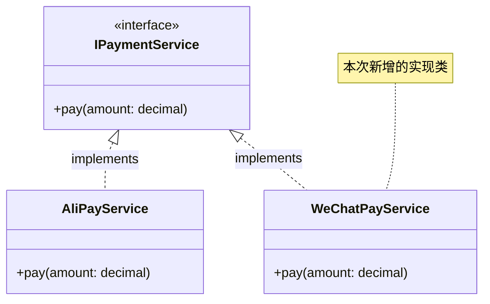

```mermaid
classDiagram
    %% 定义接口
    class IPaymentService {
        <<interface>>
        +pay(amount: decimal)
    }

    %% 现有的实现
    class AliPayService {
        +pay(amount: decimal)
    }

    %% 新增的实现
    class WeChatPayService {
        +pay(amount: decimal)
    }
    note for WeChatPayService "本次新增的实现类"

    %% 建立实现关系
    IPaymentService <|.. AliPayService : implements
    IPaymentService <|.. WeChatPayService : implements
```